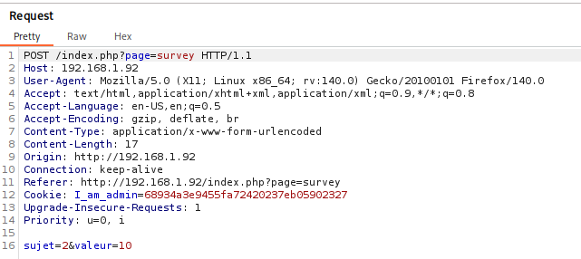
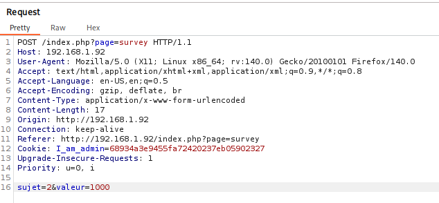
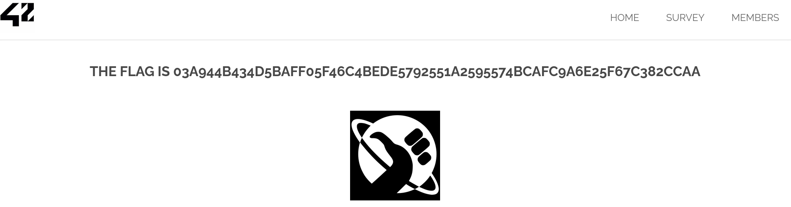

# Parameter Manipulation
<br>

**Endpoint:** `http://darkly.fr/index.php?page=survey`

<br>

# 1. Target

Functionality:

Users can submit survey scores (1–10) through the web interface.

---

<br>

# 2. Exploitation

Using Burp Suite, the parameter controlling the survey score was intercepted and modified.

Original Request:



Manipulated Request:
* Changing valeur=10 to 1000



<br>

**Result:**



<br>

# 🎉 Flag (5/14)

```
03a944b434d5baff05f46c4bede5792551a2595574bcafc9a6e25f67c382ccaa 
```
